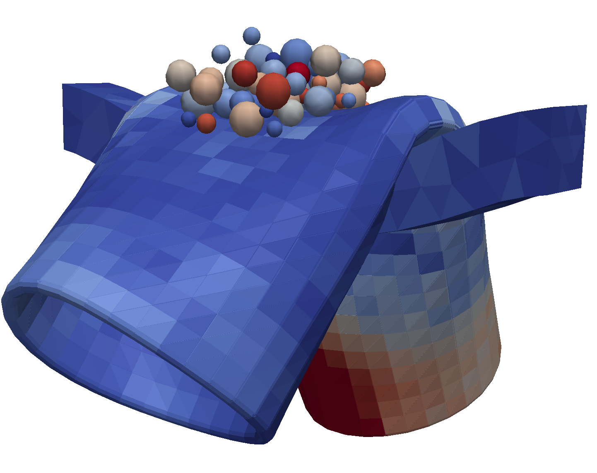
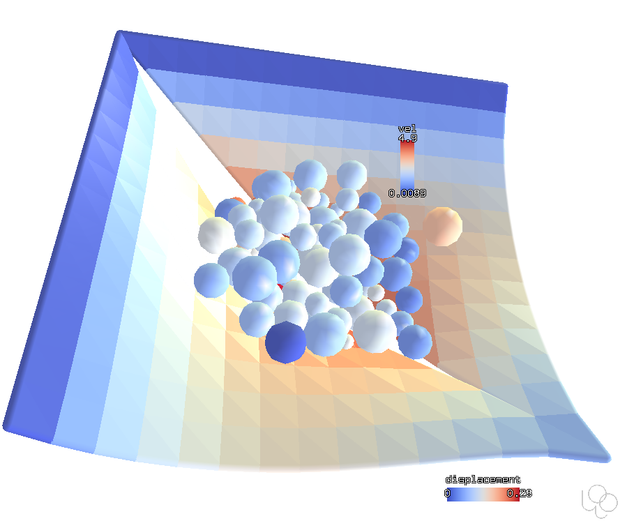

.. _gallery-fem:

Finite Elements
===============

Woo implements :ref:`plate (CST+DKT) <membrane_element>` and :ref:`tetrahedral (TET4) <tet4_element>` elements. They use corotated FEM formulation to decompose nodal displacements into rigid-body motion and element deformation. Mass and inertia is lumped into nodes.

Horse
------

This first example shows :obj:`the horse <woo.pre.horse.FallingHorse>` constructed from membrane elements, then from volume elements (without bones):

.. youtube:: 0H4r7ciuMBw

.. youtube:: BG62QAXNxbQ

Tube
----

The tube is triangulated and falls (including self-collisions) onto cylinders; the material is elastic and exhibits nicely geometrical non-linearities of the deformation:

.. youtube:: cOLMNqtCy1c

This is the same example, but rigid cylinders were replaced by deformable beam. This simulation can be found in :woosrc:`examples/tube.py`:

Triaxial test with membrane
----------------------------

This simulation is made using the :obj:`woo.pre.cylTriax.CylTriaxTest` preprocessor bundled with Woo; details are described in :ref:`case-cyl-triax`. Triaxial test first compresses the sample isotropically, then applies hydrostatic pressurae laterally (here applied by the elastic membrane) while prescribing axial deformation.

.. youtube:: Li13NrIyMYU

Split membrane
--------------

This membrane has a predefined split in the middle (used by some people to model broken plastic packaging); this example is to be found in :woosrc:`examples/membrane-split.py`.

