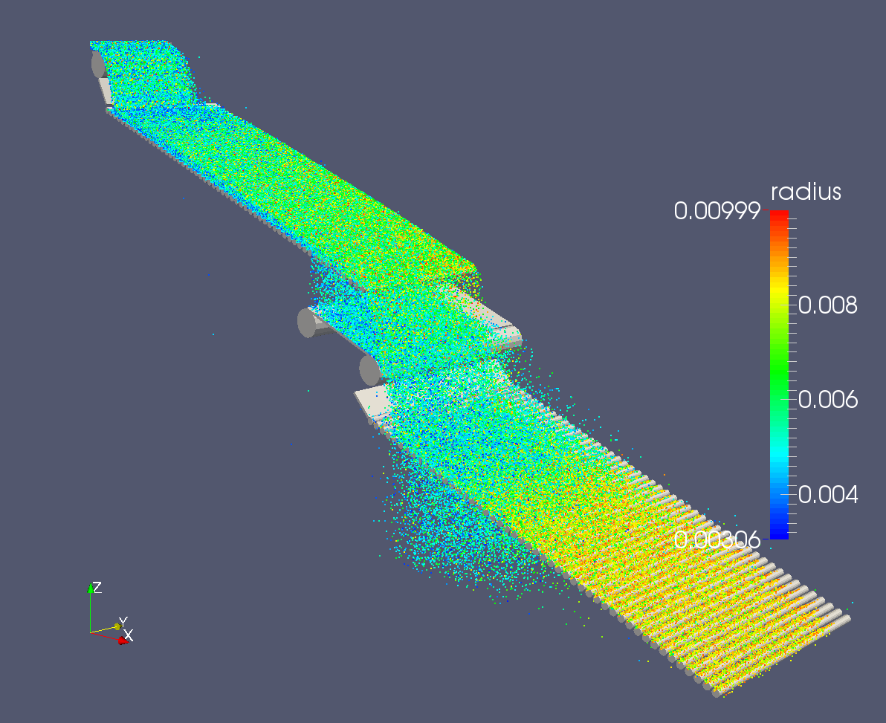

.. _gallery-granular:

Granular
=========

Sieving
--------

The rolling screen is used for sieving of granular material. The simulation was evaluating not mass rates and PSD for each individual section of the screen. Improvements of the screen design were validated using batch of simulations with several varying parameters.

This video is a HQ rendering of the screen being filled (via POV-Ray; set the video to 1440HD for better quality):

.. youtube:: p1VxvvNXDQc

This is a detail on the gap:

.. youtube:: 66N2ltj2sFk

This was an experimental small-size screen with vibrating cylinders:

.. youtube:: 2jYLx89etaM

This screen had several decks and complex transitions:

This is a plot of PSDs in 3 different parts of the screen for batch with varying feed flow rates; it is collected as statistics of pellets passing through individual gaps:

Jamming
--------

This transfer point was having issues with jamming and abrasion; the simulation was able to suggest improvements in the geometry design:

.. youtube:: UiAjvYVBMFU

This was a bin designed for partial segregation. Simulations were run to assess its efficiency and suggest improvements in the construction; this image shows layering evolution:

Here, velocity vectors are shown so that active regions are visible:

Abrasion
---------

This simulation was analyzing abrasion of the plate when directing the flow from the conveyor. Changing the shape of the plate (by running batch of parametric simulations) helped reducing abrasion effects:

Segregation
------------

The chute on the image was exhibiting segregation of fractions, desipte them being well mixed on inlet conveyor; the simulation used the chute imported from STL and using a custom-developed :ref:`flow analysis tool <user-manual-flow-analysis>`, we determined the places where the segregation was taking place, thus giving directions for improved chute design not exhibiting segregation.

