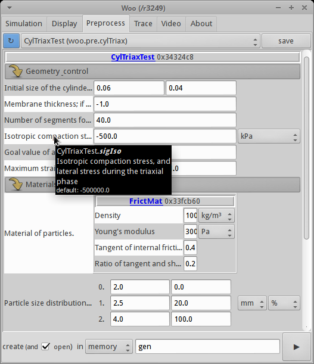
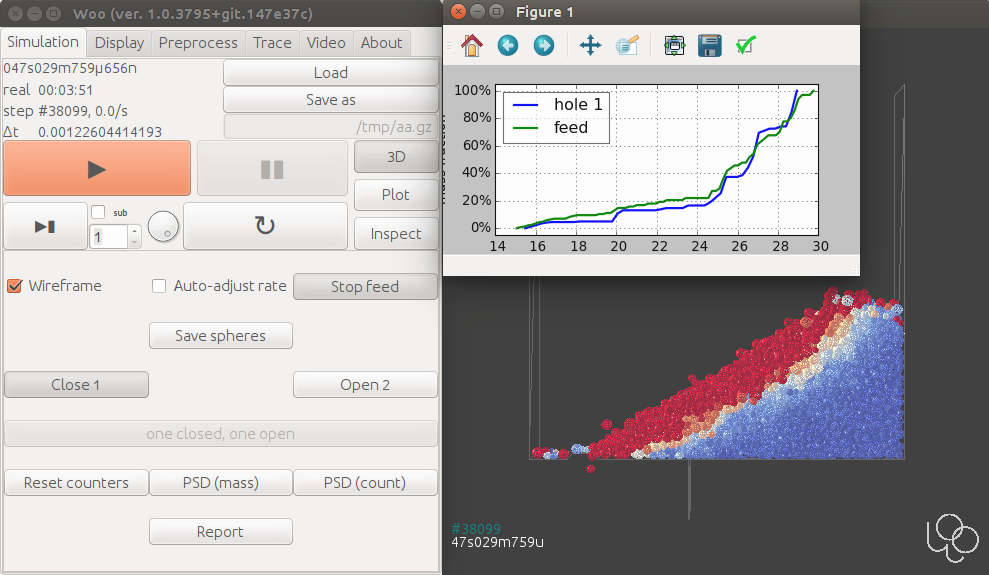

.. _gallery-interface:

Interface
=========
 	
Woo is configurable in terms of interfaces enabled during the build. While headless builds are suitable for running on computing nodes in clusters, humans developing or interacting with simulations will often make use of the graphical interface.

Graphical
----------

Most of the internal structure can be represented in the graphical interface, including documentation of all attributes (and hyperlinking full online docs):

.. image:: fig/object-editor-tooltip.png

This includes preprocessors (parametric simulation-builders) as on this image:

Some possibilities of the 3d view are shown under :ref:`Visualization <gallery-visualization>`.

Simulations can hook to the UI and show their own controls of simulation-specific parameters:

Terminal
--------

Python is Woo’s scripting language and it provides access to most internals of the simulation (all c++ objects are automatically exposed to Python). Preprocessors are (usually) written in Python, too. The old-fashioned terminal is the best we have in terms of flexibility (including remote access to headless nodes):

.. image:: fig/woo-terminal.png
   :width: 100%

