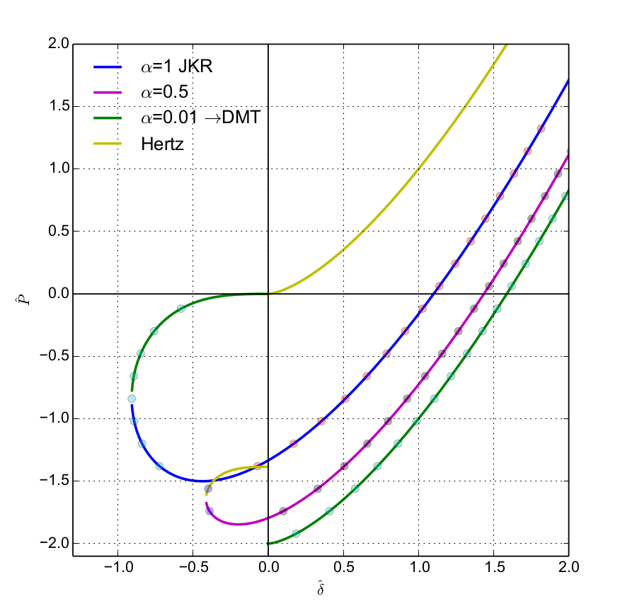

.. _gallery-models:

Models
======
 	
DEM usually assumes simplified geometry (such as spheres) and the actual physics must be expressed by the contact model. We take care to :ref:`document contact models <dem_contact_models>` thoroughly and implement them carefully.

Woo features a complete decoupling of geometry computation and contact model, thus making any new contact model immediately accessible to all contacting shapes. Developing a new contact model is a relatively easy task, once the mathematical formulation is clear (e.g. the :ref:`ice contact model <ice-contact-model>` was developed under a contract, and the :woosrc:`source code <pkg/dem/Ice.cpp>` is not all that complex).

Adhesive models
---------------

Large family of models based on :ref:`Hertz theory <hertzian_contact_models>` (for non-adhesive contact) :ref:`adding adhesion <adhesive_contact_models>` in different ways. Adhesion is implemented as described by DMT (Derjaugin-Müller-Torporov), JKR (Johnson-Kenall-Roberts) and Schwarz (which interpolates between DMT and JKR using a parameter). These models are primarily useful for micro-particle (dust) simulations.

Concrete model
--------------

The concrete contact model was developped under commercial backing, in a Woo author's thesis :cite:`Smilauer2010b`. It features cohesion with damage and visco-plasticity, and is as much as possible based on continuum models of damage, viscosity and plasticity. Calibration procedures are also described, based on dimensional analysis.

This is an ancient screenshot, when still running under `Yade <http://yade-dem.org>`__:

.. image:: fig/Tension_uniax.png
   :width: 100%

Pellet model
-------------

The :ref:`pellet contact model <pellet-contact-model>` was developed from scratch, with pen and paper, during a few days in a company working in the pelletizing industry, and subsequently adjusted and validated. It was supposed to capture the effect of partial breakage (compressive plasticity) and weak adhesion effects.

This video shows a rolling screen which is ridiculously overloaded with pellets:

.. youtube:: cujQffoxR6w

Cross-anisotropy
----------------

Cross-anisotropy was developed as a part of post-doc project and is described :ref:`in the documentation <cases-x-aniso>`. It is the usual linear contact model, but the stiffness is directionally biased so that a prescribed cross-anisotropic stiffness tensor is obtained globally:

This example is a circular hole loaded with hydrostatic pressure. Note how the deformation is bigger in the more compliant sense (vertically) while the elastic wave propagates more quickly in the stiffer sense (horizontally). Since cross-anisotropy plane is not aligned with the tunnel axis, radial pressure causes also axial deformation, which is shown at the end. Displacements are scaled.

.. youtube:: KYCvi6SNOc0
