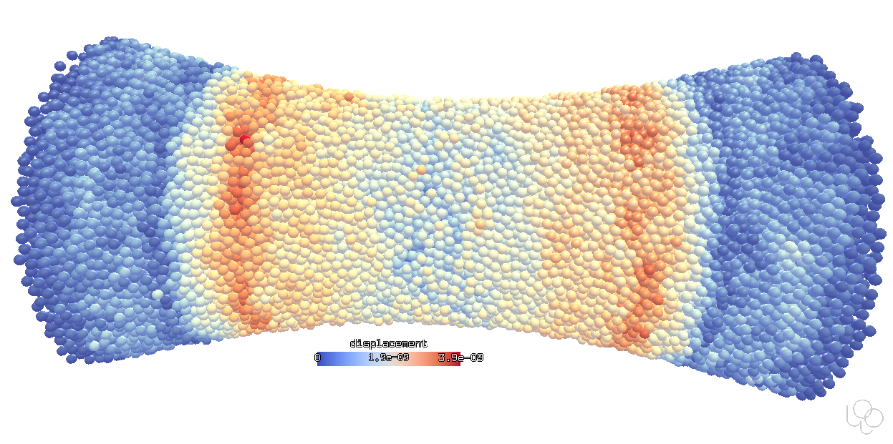
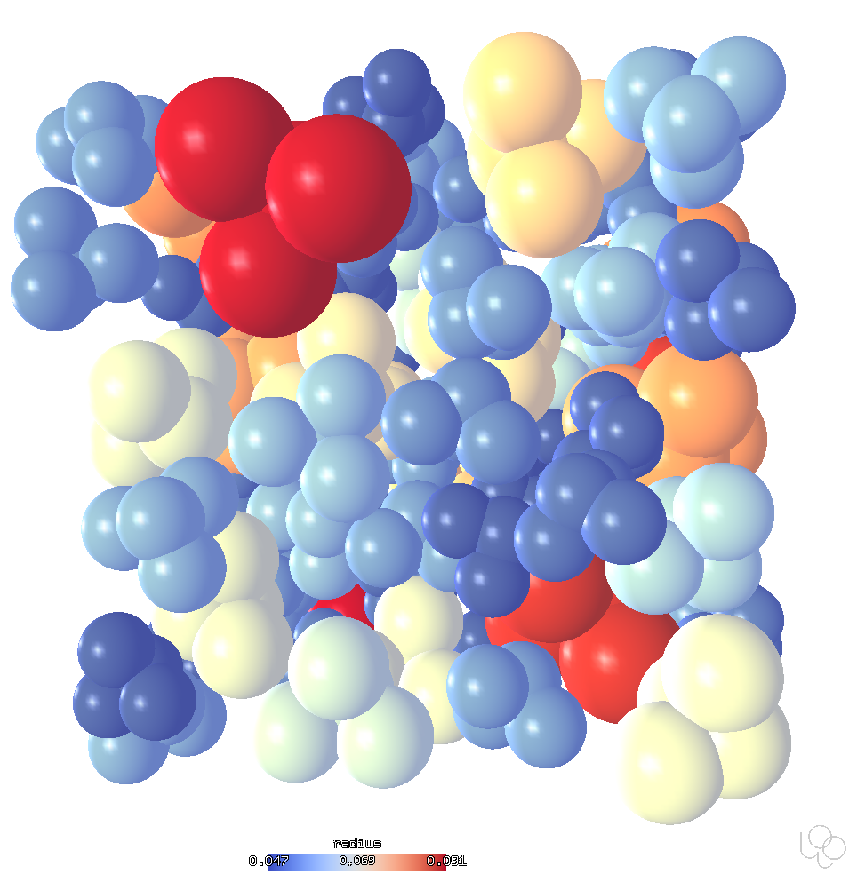
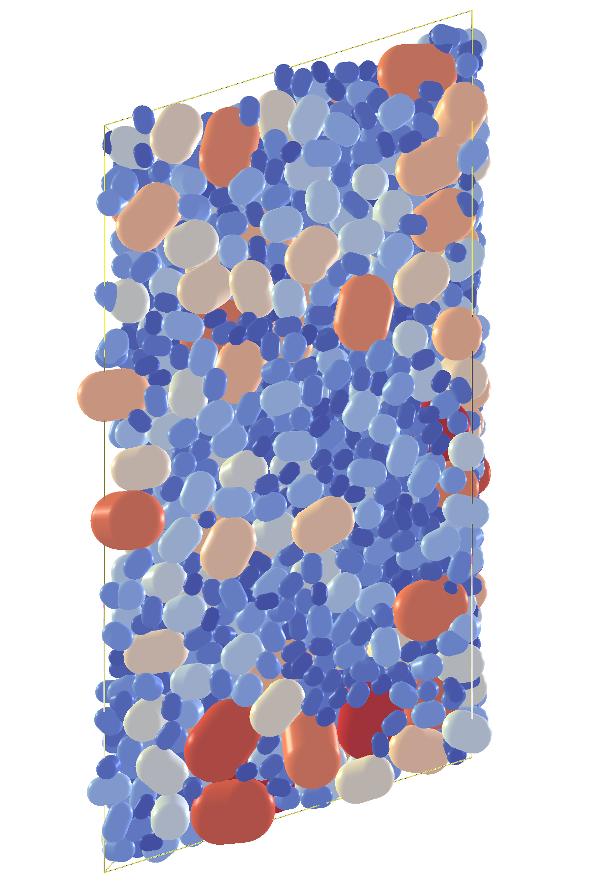
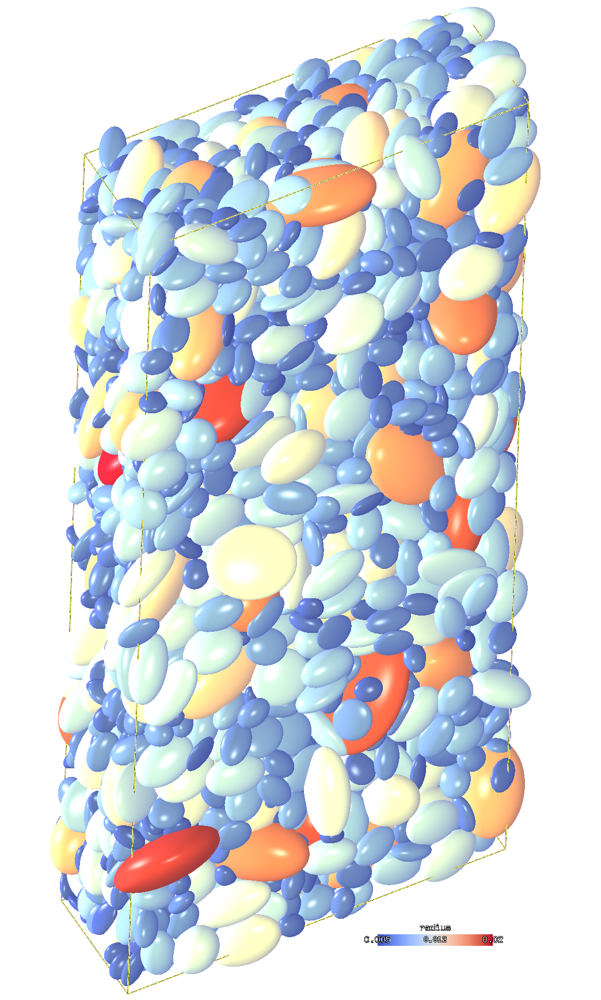

Shapes
=======
 	

There are many shapes supported by the Woo engine.

* :obj:`sphere <woo.dem.Sphere>`: Minkowski sum of 0-D simplex (plus) with sphere;
* :obj:`capsule <woo.dem.Capsule>`: Minkowski sum of 1-D simplex (segment) with sphere;
* :obj:`rounded facet <woo.dem.Facet>`: Minkowski sum of 2-D simplex (triangle) with sphere;
* :obj:`ellipsoid <woo.dem.Ellipsoid>`;
* axis-aligned :obj:`infinite cylinder <woo.dem.InfCylinder>` and :obj:`plane <woo.dem.Wall>` (often useful as boundary conditions)

These shapes are uni-nodal (they have all their mass & intertia lumped into a single node). Besides them, there is support for multi-nodal particles (:obj:`rods <woo.dem.Rod>`, :obj:`membranes <woo.fem.Membrane>`, :obj:`tetrahedral volume elements <woo.fem.Tet4>`), which not only undergo collisions, but also have internal forces (see :ref:`gallery-fem`).

Spheres
-------

Spheres are the traditional and most frequently used shapes. They are fast to compute (quick distance and contact evaluation) due to their symmetry. This images shows the initial elastic wave (when loading starts) propagating from supports towards the hyperboloidal specimen middle; this simulation can be found in :woosrc:`examples/concrete-uniax.py` and uses the :ref:`conrete contact model <concrete-contact-model>`.

Clumps
------

Clumps are rigid aggregates of other shapes (not only spheres). :woosrc:`This script <examples/clump-psd.py>` creates clumps of predefined configurations, scaled according to a PSD function.

Capsules
---------

Pharma capsules are generated by :obj:`~woo.dem.PharmaCapsuleGenerator`, using real dimension from the manufacturer. Pharmaceutical capsules are composed of two capsule-shaped particles clumped together. This simulation is treated in detail in the :ref:`tutorial <tutorial-interpolated>`; the bottle is imported from STL and the movement is prescribed in discrete points (Woo interpolates between those so that the motion is smooth).

.. youtube:: jXL8qXi780M

Capsules triaxial test
""""""""""""""""""""""

This uses the :obj:`TriaxTest preprocessor <woo.pre.triax.TriaxTest>`:

.. youtube:: qWZBCQbS6x4

Capsules in sheared periodic cell
"""""""""""""""""""""""""""""""""

This image shows sheared periodic cell with dense packing of capsules which were generated from a given PSD.

Elllipsoids
-----------

Dense packing of ellipsoids, under discaplement-controlled shear loading. Ellipsoids are rather slow to compute (there is no closed-form distance function for them) but very useful due to their smooth roundness function (the theory is of course described :ref:`in the documentation <theory-geom-ellipsoid>`):

These are ellipsoids under constrained motion (in 2D) colliding in a rectangular area:

.. youtube:: t1AHWO4FgMk

Triangulation
-------------

This demonstrates the ability of rounded facets to collide with each other; this simulation is in :woosrc:`examples/facet-facet.py`. For more collisions of triangualted surfaces, see :ref:`FEM <gallery-fem>`.

.. youtube:: jeiMXUdQwOM
