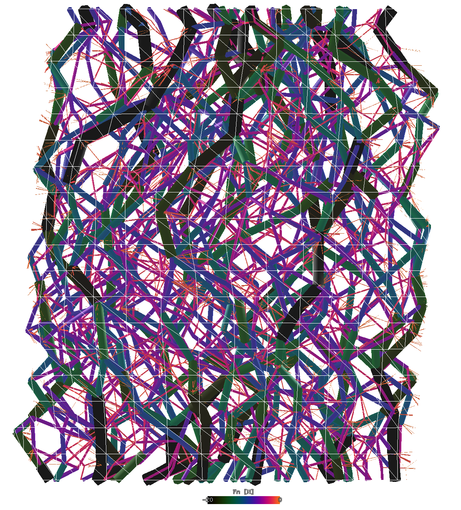
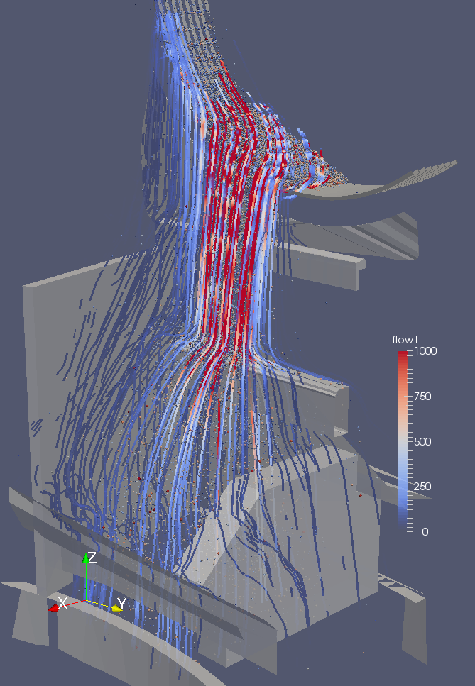
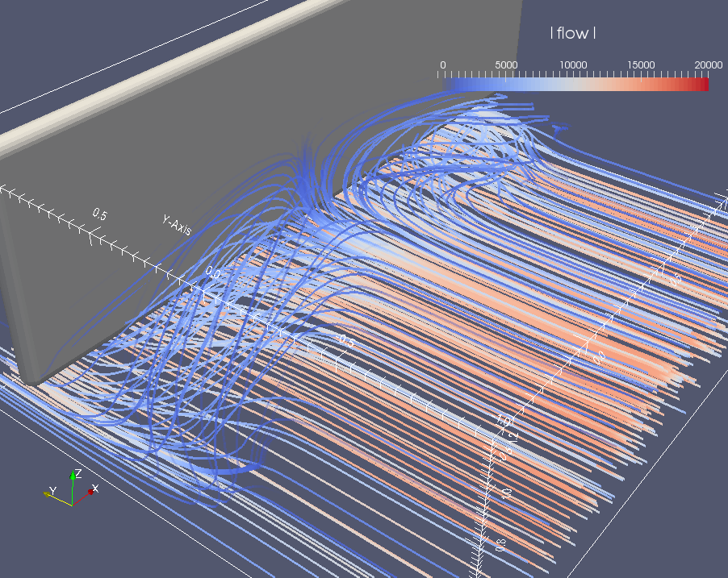

.. _gallery-visualization:

Visualization
=============

Woo has a built-in 3d view made for detailed inspection of simulations and seeing what matters. It supportes displacement & rotation scaling, selecting & inspecting objects and many other things.

Force chains
-------------

These are force chains during the cylindrical triaxial test, with scaled (magnified) nodal displacements:

.. youtube:: o4cS1f4-CEI

Particle traces
---------------

With configurable coloring, length and export to VTK if needed:

.. youtube:: xBCk1-0ZTbM

.. youtube:: nQD8sojqNy0

Flow analysis
--------------

:obj:`woo.dem.FlowAnalysis` is useful e.g. for visualizing average flow rates, which can make important features of the processes really stand out:

This is the average flow for the screed wall of which video is shown below:

Paraview movies
---------------

While Woo itself concentrates on being a superb simulation tool, the possibility to export to Paraview allows to create beautiful renderings of the scene, which is useful not just for presenting the results to the management, but also as an important aid for understanding the underlying physical processes:

.. youtube:: jXL8qXi780M

Screed wall simulation (flow analysis image is above):

.. youtube:: a1D1Ia9WwDY
